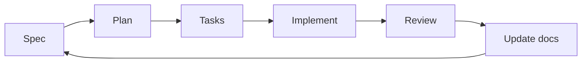

# Architecture

## Purpose

This project is a lightweight scaffold for Spec Driven Development combined with Agile.

## Core Design

- Markdown-first documentation.
- Specs separated by functionality and epic.
- Small, reusable skills instead of large prompts.
- Lean context loading: each agent reads only what it needs.
- Docs are the source of truth.
- A tiny curated `skills/` set covers clarification, architecture, and TDD.
- Verification happens inside `Implement`, so testing is not a separate sprint phase.
- Optional skills can be used inside `Spec`, `Plan`, `Tasks`, or `Implement` when they fit the current phase.
- Skills can be installed as `none`, `manual`, or `auto`, but only when the user opts in.
- External capabilities are added through MCP when needed.

## Repository Layers

- `AGENTS.md`: constitution and navigation rules for agents.
- `docs/`: architecture and roadmap.
- `specs/`: project-wide specs plus per-epic specs, plans, and tasks.
- `skills/`: optional reusable agent helpers, kept small.
- MCP integrations: optional tools for external systems.

## Workflow Model

### Phase Contract

- `Spec`: define the problem, the goal, and the user stories.
- `Plan`: order the user stories and record delivery decisions.
- `Tasks`: split each user story into small, trackable tasks.
- `Implement`: build the smallest useful change and verify it as you go.
- `Review`: check the result against the docs and close the epic when it is ready.

Each phase leaves enough context for the next one to continue without guessing.

## Governance

- Developers own Git flow and release decisions.
- Agents can assist with planning, implementation, verification, and review.
- Any meaningful scope or behavior change must be reflected in docs first.
